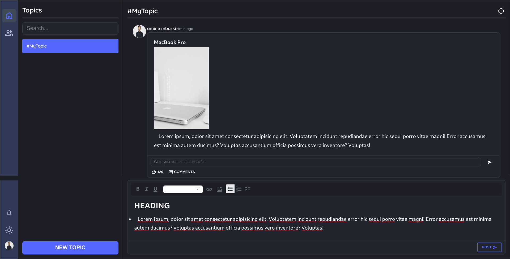

# Introduction 
A collaboration tool for team members similar to slack.

## 🔋 Features
* Users can login and register

* Users can use social login (Google)

* Users can search and add other users as members of their team

* Uses can remove members from their team

* Users can create, delete and edit a topic

* Users can invite members of their team to a topic

* Users can remove subscribers from a topic they've created

* Users can post in a topic they're subscribed to

* Users receive notification when a new post has been added to a topic they're subscribed to

## ⚙️ Tech Stack

### Frontend

* TypeScript
* React
* Redux toolkit
* React form hook
* Css modules

### Backend

* Java
* Spring boot
* Spring data jpa
* Spring MVC
* Spring security 
* Spring oauth resource server
* postgresql

## 🕸️ Conceptual Modal
 (1).jpg>)

